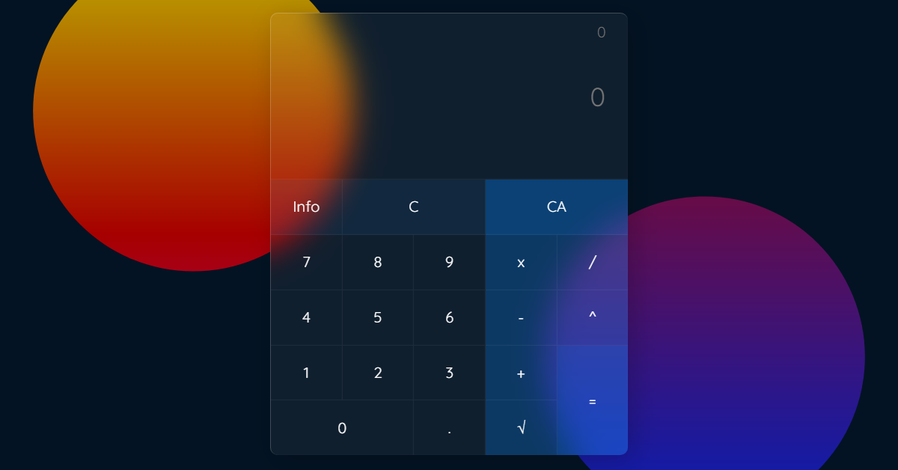

# Calculator

With this calculator you can solve operations that include addition ➕, subtraction ➖, division ➗, multiplication ✖️ and power 💪 continuously, that is, you can write all that in a row, and see what you write, then hit the equal button and get your result!✔️

You can also solve square roots 🌱 but this mode is not compatible with the other modes, that is, if you enter the root sign you cannot enter the others and vice versa.

All operations support decimals, and display results up to 4 decimal places 👌

_Keyboard keys are supported on PC_



## Demo 🚀

_You can open this link on both desktop and mobile._

[https://leonardomeza87.github.io/calculator/](https://leonardomeza87.github.io/calculator/)

You can install this app on your device as a Progressive Web App!

## Download ⚙️

_This project does not have any dependencies, it is pure HTML, CSS and JS code._

To download it copy the code below and paste it in your terminal.

```
git clone https://github.com/leonardomeza87/vanilla-calculator.git
```

---

3 cups of ☕ were used in this repository. 😊
